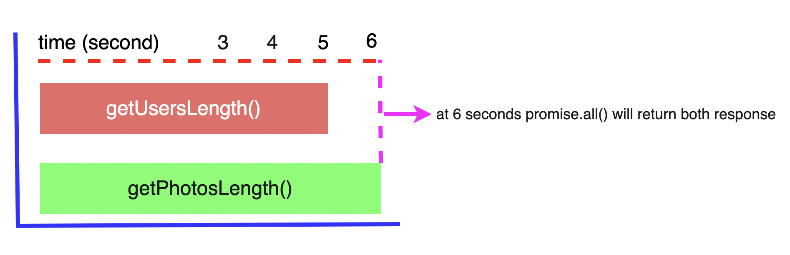

# JavaScript Promises Tips & Tricks

## Tip #1: Promise Chaining

instead of this, 

```js
axios.get('https://jsonplaceholder.typicode.com/posts')
    .then(res => {
        console.log(res.data);
        getPhotos()
            .then(photos => {
                console.log(photos.data)
            })
    })
    .catch(err => {
        console.error(err)
    })

function getPhotos() {
    return axios.get('https://jsonplaceholder.typicode.com/photos');
}
```

use like this,

```js
axios.get('https://jsonplaceholder.typicode.com/posts')
    .then(res => {
        console.log(res.data);
        return getPhotos();
    })
    .then(res => {
        console.log(res.data);
    })
    .catch(err => {
        console.error(err)
    })

function getPhotos() {
    return axios.get('https://jsonplaceholder.typicode.com/photos');
}
```

## Tip 2: Speed up promises with promise.all()

instead of this,

```js
function getUsersLength() {
    return new Promise(resolve => {
        setTimeout(() => {
            resolve(['lahin', 'hussain'].length)
        }, 5000);
    })
}

function getPhotosLength() {
    return new Promise(resolve => {
        setTimeout(() => {
            resolve(['photo 1', 'photo 2'].length)
        }, 6000);
    })
}

async function doSomething() {
    try {
        const usersLength = await getUsersLength();
        const photosLength = await getPhotosLength();
    
        console.log(usersLength, photosLength); // 2, 2
    } catch(err) {
        throw new Error(err);
    }
}

doSomething();
```
after 11 seconds you can see the result [2, 2].

use like this,

```js
function getUsersLength() {
    return new Promise(resolve => {
        setTimeout(() => {
            resolve(['lahin', 'hussain'].length)
        }, 5000);
    })
}

function getPhotosLength() {
    return new Promise(resolve => {
        setTimeout(() => {
            resolve(['photo 1', 'photo 2'].length)
        }, 6000);
    })
}

async function doSomething() {
    try {
        const [usersLength, photosLength] = await Promise.all([getUsersLength(), getPhotosLength()]);
        console.log(usersLength, photosLength); // [5, 5]
    } catch(err) {
        throw new Error(err);
    }
}

doSomething();
```
`getUsersLength()` took 5 seconds to resolve and `getPhotosLength()` took 6 seconds to resolve. `promise.all()` will executes those functions parallelly, so after 6 seconds you can see the result.

<p align="center">
  
</p>